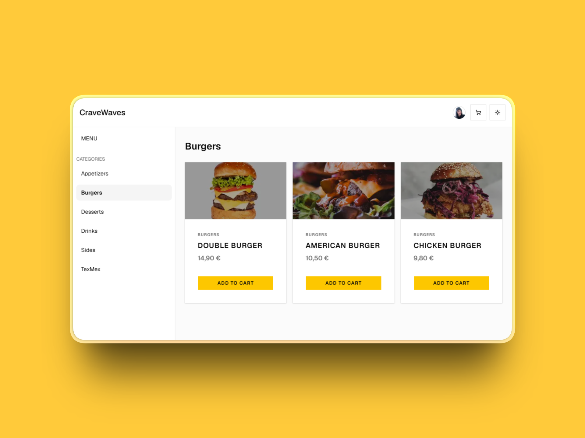
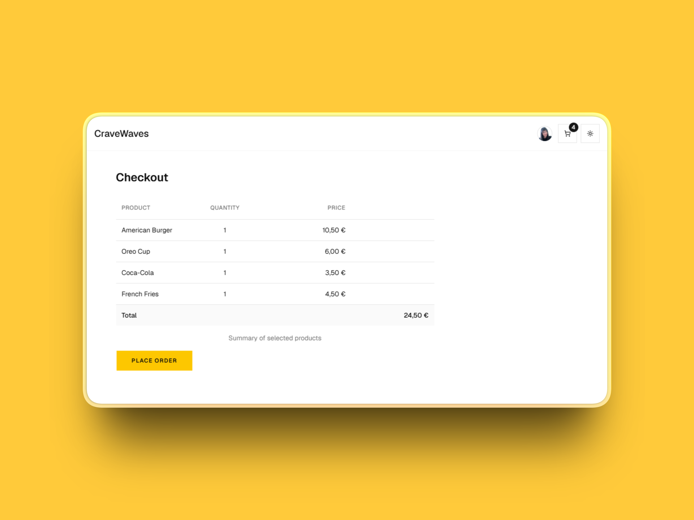
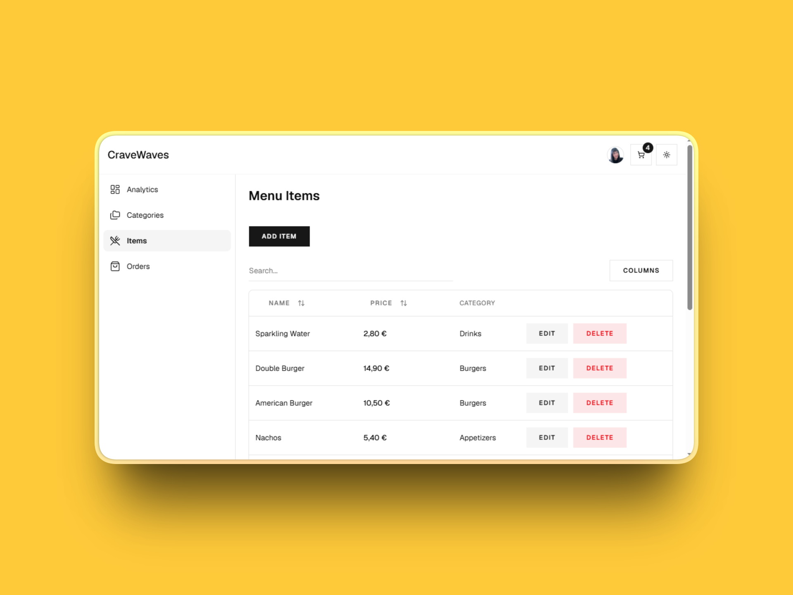
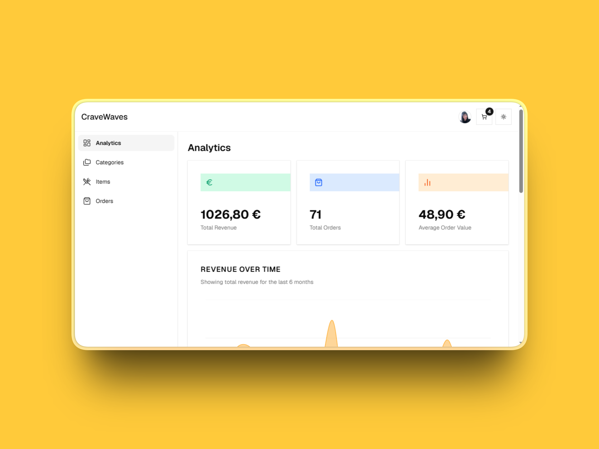
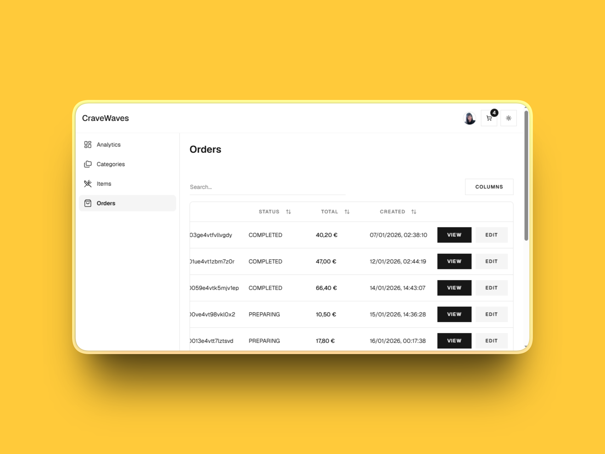

# Cravewaves - Food Ordering Platform

A SaaS-style food ordering platform that enables restaurants to manage their own menus and orders without relying on third-party marketplaces.


---

## Live Demo

[Live Demo](https://food-ordering-cravewaves.vercel.app/)

The live demo provides:

- Read-only access
- Seeded demo data
- No sign-up required

---

## Table of Contents

* [Project Overview](#project-overview)
* [Features](#features)
* [Screenshots](#screenshots)
* [Technology Stack](#technology-stack)
* [Architecture Overview](#architecture-overview)
* [Folder Structure](#folder-structure)
* [Installation](#installation)
* [Environment Variables](#environment-variables)
* [Database Setup](#database-setup)
* [Running Locally](#running-locally)
* [Running Tests](#running-tests)
* [Deployment](#deployment)
* [API Documentation](#api-documentation)
* [Security Notes](#security-notes)
* [Performance Considerations](#performance-considerations)
* [Contributing Guidelines](#contributing-guidelines)
* [License](#license)

---

# Project Overview

**Cravewaves** is a SaaS-style food ordering platform that enables restaurants to manage their own menus, orders, and business operations through an integrated customer ordering experience and an admin dashboard, giving restaurants full ownership of their ordering system and data.

---

# Features

## Customer Features

- Google OAuth authentication
- Browse restaurant menu
- View menu categories
- Shopping cart with persistent state
- Checkout flow
- Stripe payment integration 
- Order success and cancellation pages
- Fully responsive UI
- Light/Dark mode support

## Admin Features

### Dashboard

- View all customer orders
- View individual order details
- Update order status

### Menu Management

- Create categories
- Edit categories
- Delete categories
- Create menu items
- Edit menu items
- Delete menu items

### Data Table Utilities

- Search
- Filtering
- Column visibility controls

### Analytics

Business insights including:

- Total Revenue
- Total Orders
- Average Order Value
- Revenue Over Time (Area Chart)
- Top 5 Selling Items (Horizontal Bar Chart)

## Demo Mode

Supports a read-only demonstration mode.

Characteristics:

- OAuth disabled
- Seeded demo accounts
- Read-only UI
- No registration required

Configuration:

```env

NEXT_PUBLIC_DEMO_MODE=true

```

---

# Screenshots

## Customer Menu

<p align="center">
  
  
</p>

## Checkout

<p align="center">
  
  
</p>

## Admin Dashboard

<p align="center">
  
  
</p>

## Analytics

<p align="center">
  
  
</p>

## Orders Management

<p align="center">
  
  
</p>

---

# Technology Stack

| Category | Technology |
|-----------|------------|
| Framework | Next.js |
| ORM | Prisma |
| Database | Neon |
| Authentication | NextAuth (Google OAuth) |
| Payments | Stripe |
| UI Components | Shadcn/UI |
| State Management | Zustand |
| Validation | Zod |
| Charts | Recharts |
| Deployment | Vercel |

---

# Architecture Overview

The application is organized into separate customer and admin experiences using the Next.js App Router.

```
Customer
    │
    ▼
Next.js App Router
    │
    ├──────────────► Authentication (NextAuth)
    │
    ├──────────────► Stripe Checkout
    │
    ├──────────────► Prisma ORM
    │
    ▼
 Neon Database

Admin Dashboard
    │
    ├── Menu Management
    ├── Orders
    └── Analytics
```

### Architecture Responsibilities

- **Next.js** handles routing and rendering.
- **Prisma** provides database access.
- **Neon** stores application data.
- **Stripe** processes payments.
- **NextAuth** handles Google authentication.
- **Zustand** manages persistent cart state.
- **Recharts** powers dashboard analytics.

---

# Folder Structure

```text
app/
│
├── (admin)/
│   └── dashboard/
│       ├── categories/
│       ├── items/
│       └── orders/
│
├── (customer)/
│   ├── checkout/
│   ├── cancel/
│   └── success/
│
├── (public)/
│   ├── menu/
│   └── categories/
│       └── [category]/
│
├── api/
│   ├── auth/
│   └── stripe/
│
└── store/

components/

hooks/

lib/
├── admin/
├── customer/
└── dal.ts

prisma/
└── migrations/

public/

types/
```

---

# Installation

Clone the repository.

```bash
git clone https://github.com/dnmore/food-ordering
```

Navigate into the project.

```bash
cd food-ordering
```

Install dependencies.

```bash
npm install
```

---

# Environment Variables

The following environment variables are required.


```env
# Database
DATABASE_URL=
DIRECT_URL=

# NextAuth
AUTH_SECRET=

# OAuth Provider
AUTH_GOOGLE_ID=
AUTH_GOOGLE_SECRET=

# Stripe
STRIPE_SECRET_KEY=
NEXT_PUBLIC_STRIPE_PUBLISHABLE_KEY=
STRIPE_WEBHOOK_SECRET=
NEXT_PUBLIC_APP_URL=
```

---

# Database Setup

Generate the Prisma Client.

```bash
npx prisma generate
```

Run migrations.

```bash
npx prisma migrate deploy
```

For local development:

```bash
npx prisma migrate dev
```


---

# Running Locally

Start the development server.

```bash
npm run dev
```

Visit:

```
http://localhost:3000
```

---
# Running Tests

The project uses **Jest**.

Run the test suite:

```bash
npm test
```

---

# Deployment

The application is deployed on **Vercel**.

Typical deployment workflow:

1. Push the repository to your Git provider.
2. Import the project into Vercel.
3. Configure all required environment variables.
4. Deploy.

External services that must be configured:

- Neon Database
- Google OAuth
- Stripe 

---

# API Documentation

The application exposes API routes for authentication and Stripe payment processing. During checkout, a server action creates both the Stripe Checkout Session and a corresponding order in the database with an initial **PENDING** status. Stripe webhook events subsequently update the order status based on the payment outcome, ensuring the database remains synchronized with Stripe.

The project exposes API routes under:

```text
app/api/
```

### Authentication

```text
/api/auth/[...nextauth]
```

Handles authentication using NextAuth with Google OAuth.

### Stripe Webhook

```text
/api/stripe/webhook
```

Handles Stripe webhook events to synchronize payment outcomes with the application's database.

Supported events:

- `checkout.session.completed`
  - Updates the corresponding order status from **PENDING** to **PAID**.
  - Redirects the customer to the success page.
  - Shopping cart is cleared.

- `checkout.session.expired`
  - Updates the corresponding order status from **PENDING** to **CANCELLED**.
  - Redirects the customer to the cancellation page.
  - Shopping cart is preserved, allowing the customer to retry checkout.

- `payment_intent.payment_failed`
  - Updates the corresponding order status from **PENDING** to **CANCELLED**.
  - Redirects the customer to the cancellation page.
  - Shopping cart is preserved, allowing the customer to retry checkout.

---

# Security Notes

Authentication and authorization are implemented using **NextAuth** together with a dedicated data access layer (`lib/dal.ts`).

The data access layer provides the following security responsibilities:

- Verifies authenticated sessions before allowing access to protected pages, redirecting unauthenticated users to the landing page.
- Retrieves the authenticated user's role to dynamically render customer- or admin-specific navigation links.
- Enforces role-based authorization ensuring only authenticated users with the Admin role can access administrative pages and perform CRUD operations for categories, menu items, and orders. Unauthorized users are redirected to the landing page.

Additional security measures include:

- Google OAuth authentication via NextAuth.
- Stripe Test Mode for payment processing.
- Zod validation for form inputs.
- Prisma ORM for type-safe database access.

---

# Performance Considerations

The application incorporates several performance optimizations:

### Server-side Data Caching

- Uses `unstable_cache` to cache database queries powering the admin dashboard analytics and data tables.

### On-Demand Cache Invalidation

- Uses `revalidateTag` to invalidate cached data associated with specific cache tags.
- Uses `revalidatePath` throughout admin and customer server actions to refresh affected routes after data mutations.

### Optimized Loading Experience

- Uses React `Suspense` together with skeleton components for dashboard cards, charts, and tables.
- Implements a dedicated `loading.tsx` with an animated loader for the `menu/categories/[category]` route.

### Image Optimization

- Uses next/image with explicit width and height attributes to optimize image loading and reduce layout shift.


---

# Contributing Guidelines

Contributions are welcome.

Recommended workflow:

1. Fork the repository.
2. Create a feature branch.

```bash
git checkout -b feature/my-feature
```

3. Commit your changes.

```bash
git commit -m "Add feature"
```

4. Push your branch.

```bash
git push origin feature/my-feature
```

5. Open a Pull Request.

---

# License

This project is licensed under the **MIT License**.

